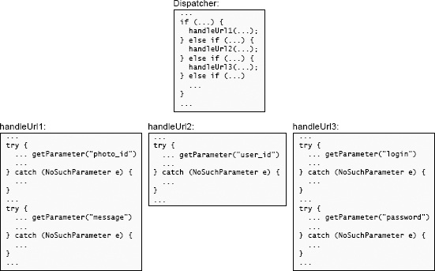

# 5.4 例子：HTTP服务器

为了说明信息隐藏的问题，让我们考虑一下在软件设计课程中实现HTTP协议的学生所作的设计决策。看看他们做得好的地方和他们有问题的地方都是很有用的。

HTTP是Web浏览器用来与Web服务器通信的一种机制。当用户在Web浏览器中点击一个链接或提交一个表单时，浏览器就会使用HTTP通过网络向Web服务器发送一个请求。一旦服务器处理完请求，它就会向浏览器发送一个响应；该响应通常包含一个要显示的新网页。HTTP协议规定了请求和响应的格式，两者都以文本形式表示。图5.1展示了一个描述表单提交的HTTP请求示例。该课程的学生被要求实现一个或多个类，以使Web服务器能够方便地接收传入的HTTP请求并发送响应。

