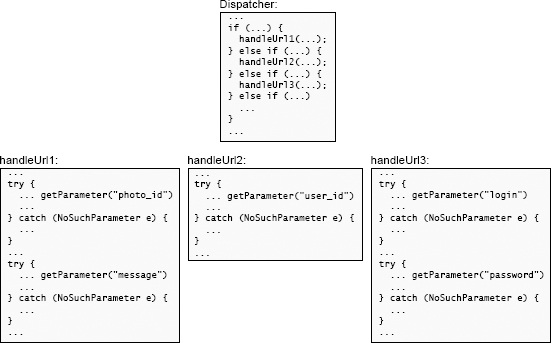

# 10.7 异常聚合

减少与异常有关的复杂性的第三个技术是异常聚合（_exception aggregation_）。异常聚合背后的想法是用一段代码来处理许多异常；与其为许多单独的异常编写不同的处理程序，不如在一个地方用一个处理程序来处理所有这些异常。

考虑一下如何处理网络服务器中缺失的参数。一个Web服务器实现了一系列的URL。当服务器收到一个传入的URL时，它会分配一个特定于URL的服务方法来处理该URL并生成一个响应。URL包含各种参数，用于生成响应。每个服务方法将调用一个较低级别的方法（让我们称之为`getParameter`），以从URL中提取它所需要的参数。如果URL不包含所需的参数，`getParameter`会抛出一个异常。

当软件设计课上的学生实现这样一个服务器时，他们中的许多人把对`getParameter`的每个不同的调用都包裹在一个单独的异常处理程序中，以捕捉`NoSuchParameter`异常，如图10.1。这导致了大量的处理程序，所有这些处理程序基本上都做同样的事情（生成一个错误响应）。

一个更好的方法是聚合异常。与其在各个服务方法中捕捉异常，不如让它们传播到Web服务器的顶层调度方法中，如图10.2所示。这个方法中的一个处理程序可以捕捉所有的异常，并为缺失的参数生成一个适当的错误响应。

在Web的例子中，可以进一步采取聚合的方法。在处理Web页面时，除了缺失的参数，还有许多其他的错误；例如，一个参数可能没有正确的语法（服务方法期望的是一个整数，但值是“xyz”），或者用户可能没有请求操作的权限。在每一种情况下，错误都应该导致一个错误响应；错误的区别只在于响应中包含的错误信息（“URL中没有'`quantity`'参数”或“'`quantity`'参数的值'xyz'不好；必须是正整数”）。因此，所有导致错误响应的情况都可以用一个顶层的异常处理程序来处理。错误信息可以在抛出异常时产生，并作为一个变量包含在异常记录中；例如，`getParameter`将产生“URL中没有'`quantity`'参数”的信息。顶层处理程序从异常中提取消息并将其纳入错误响应中。

.png>)

从封装和信息隐藏的角度来看，上一段中描述的聚合具有良好的特性。顶层的异常处理程序封装了关于如何生成错误响应的知识，但它对具体的错误一无所知；它只是使用异常中提供的错误信息。`getParameter`方法封装了关于如何从URL中提取参数的知识，它还知道如何以人类可读的形式描述提取错误。这两块信息是密切相关的，所以把它们放在同一个地方是有意义的。然而，`getParameter`对HTTP错误响应的语法一无所知。随着新的功能被添加到Web服务器中，像`getParameter`这样的新方法可能会被创建，并带有它们自己的错误。如果新方法以与`getParameter`相同的方式抛出异常（通过生成继承自同一超类的异常，并在每个异常中包含一个错误信息），它们可以插入到现有的系统中，而无需其他改动：顶层的处理程序将自动为它们生成错误响应。

这个例子说明了异常处理的一个普遍有用的设计模式。如果一个系统处理一系列的请求，定义一个异常是很有用的，它可以中止当前的请求，清理系统的状态，然后继续下一个请求。异常被捕获在系统请求-处理循环的顶部附近的一个地方。这个异常可以在处理请求的任何时候抛出，以中止请求；可以为不同的情况定义不同的异常子类。这种类型的异常应该与对整个系统来说是致命的异常明确区分开来。

如果一个异常在被处理之前在堆栈中向上传播了几级，那么异常聚合的效果最好；这允许在同一个地方处理来自更多方法的异常。这与异常屏蔽相反：如果异常在低级方法中被处理，屏蔽通常效果最好。对于屏蔽来说，低级别方法通常是一个被许多其他方法使用的库方法，所以允许异常传播会增加处理异常的地方。屏蔽和聚合的相似之处在于，这两种方法都将异常处理程序定位在可以捕获最多的异常的地方，从而消除了许多原本需要创建的处理程序。

异常聚合的另一个例子发生在用于崩溃恢复的RAMCloud存储系统中。一个RAMCloud系统由一个存储服务器的集合组成，每个对象都有多个副本，所以系统可以从各种故障中恢复。例如，如果一台服务器崩溃并丢失了所有的数据，RAMCloud会使用存储在其他服务器上的副本重建丢失的数据。错误也可能发生在较小的范围内，例如，服务器可能发现个别对象被损坏。

RAMCloud并没有为每一种不同的错误设立单独的恢复机制。相反，RAMCloud将许多较小的错误“提升”为较大的错误。原则上，RAMCloud可以通过从备份副本中恢复该对象来处理损坏的对象。然而，它并没有这样做。相反，如果它发现一个损坏的对象，它就会使包含该对象的服务器崩溃。RAMCloud使用这种方法是因为崩溃的恢复是相当复杂的，这种方法最大限度地减少了必须创建的不同恢复机制的数量。为崩溃的服务器创建一个恢复机制是不可避免的，所以RAMCloud对其他类型的恢复也使用相同的机制。这减少了必须编写的代码量，也意味着服务器崩溃的恢复被更频繁地调用。因此，恢复代码中的bug更有可能被发现和修复。

将一个损坏的对象提升为服务器崩溃的一个缺点是，它大大增加了恢复的成本。这在RAMCloud中不是问题，因为对象损坏是相当罕见的。但是，对于频繁发生的错误，错误提升可能没有意义。 举个例子，当服务器的一个网络数据包丢失时使服务器崩溃是不切实际的。

关于异常聚合的一种思考方式是，它用一个可以处理多种情况的通用机制取代了几种专用机制，其中每种机制都是为特定情况量身定做的。这为通用机制的好处提供了另一个例证。
